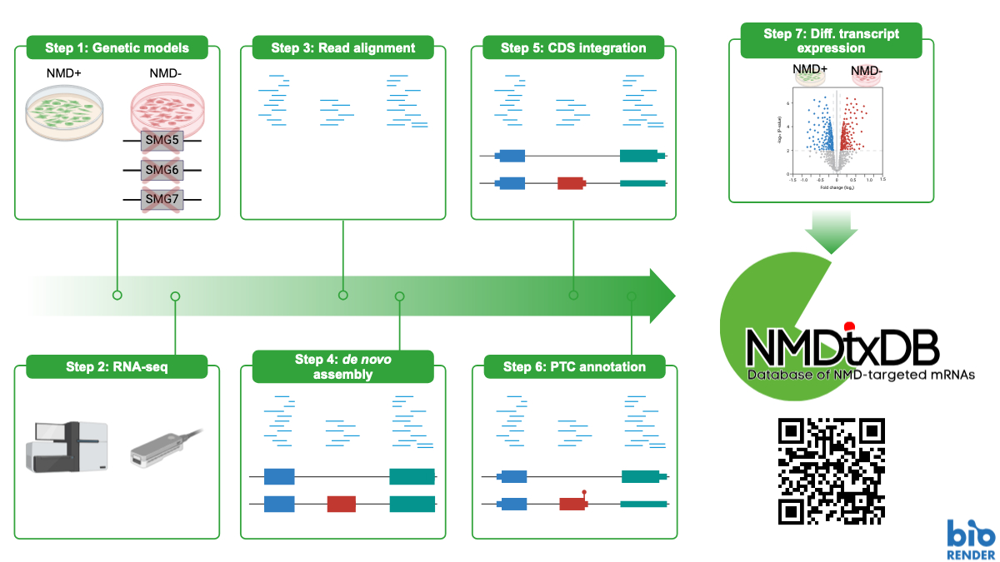

# NMDtxDB: Data-driven identification and annotation of human NMD target transcripts

We use a data-driven approach to discover novel transcripts, focusing on identifying isoforms that are targets of Nonsense-Mediated RNA Decay (NMD) but are missing from reference databases. Our goal is to make this resource accessible to a wide audience. The database currently provides evidence of premature stop codons (PTC) based on transcript structure and includes feature (gene or transcript) abundances. NMDtxDB is not intended to replace reference annotations, but to collect evidence of NMD activation and further understand NMD rules. We aim to present this resource on an easy-to-use platform that others can replicate, hoping it will help researchers identify relevant features and understand their regulatory roles in post-transcriptional regulation.

## Introduction to NMDtxDB

### Content description

NMDtxDB is a database dedicated to exploring transcripts that may be targeted by the NMD pathway. This web-application currently collects the results obtained for four cell lines depleted for NMD factors, as further detailed in our below and in our research manuscript. 

The NMDtxDB is constructed using data from cells lines depleted for key NMD-factors, offering a comprehensive insight into these NMD depletion conditions. We've also incorporated Nanopore sequencing, which improves on the detection of splicing isoforms, along with three CDS sources, that allow us to infer coding sequence (CDS) that are currently not annotated on the reference database. The figure below has a simplified overview of our workflow:

Our work is open-source and available at GitHub: https://github.com/dieterich-lab/nmd-wf. The Shiny App source is available at https://github.com/dieterich-lab/NMDtxDB. Both projects are licensed under MIT. We welcome contributions and feedback from the community to further improve our source code, and are considering new data sets and data modalities to enhance the database.

A full description of the database and its construction can be found in our [manuscript](http://dx.doi.org/10.1261/rna.080066.124).

### Computational Workflow

We’ve developed a unique computational workflow for transcriptome construction and premature stop codon (PTC) annotation. This allows users to compare PTC status with transcript expression, helping to identify unannotated NMD targets and understand NMD activation better.

Building transcriptomes from RNA-seq datasets is challenging. Long-read sequencing helps, but has its limitations. NMD pathway suppression aids by enriching for putative NMD target transcripts. However, users should interpret database results cautiously when prioritizing targets for experimental validation.

Our workflow includes multiple CDS sources for further exploration. Besides the canonical CDS from Ensembl, we include Ribo-seq and OpenProt CDS annotations from high-throughput datasets. The Ensembl CDS is adapted to novel transcripts.

Our approach is particularly useful for studying alternative splicing's impact on NMD, as not all NMD substrates are equally degraded, and some may escape degradation altogether.

### Front-end Application

Our web application is designed with a strong focus on simplicity and usability, making the database accessible to a wider audience. The initial feedback from our prototypes, presented at prominent RNA conferences, has been extremely encouraging.

The application is built using Shiny and Golem and is hosted with ShinyProxy via docker containers. In principle, this infra-structure could be used elsewhere, although we currently offer little support to external servers. We recently improved the user experience with a tutorial to guide users through the web application. Additionally, we optimized the front-end initialization time and database query performance to ensure a seamless user journey.

Please give us some <a href="https://forms.gle/ZnaCwzNpFDPUHeh27" target="_blank"><b>Feedback</b></a>  and help us improve further!
